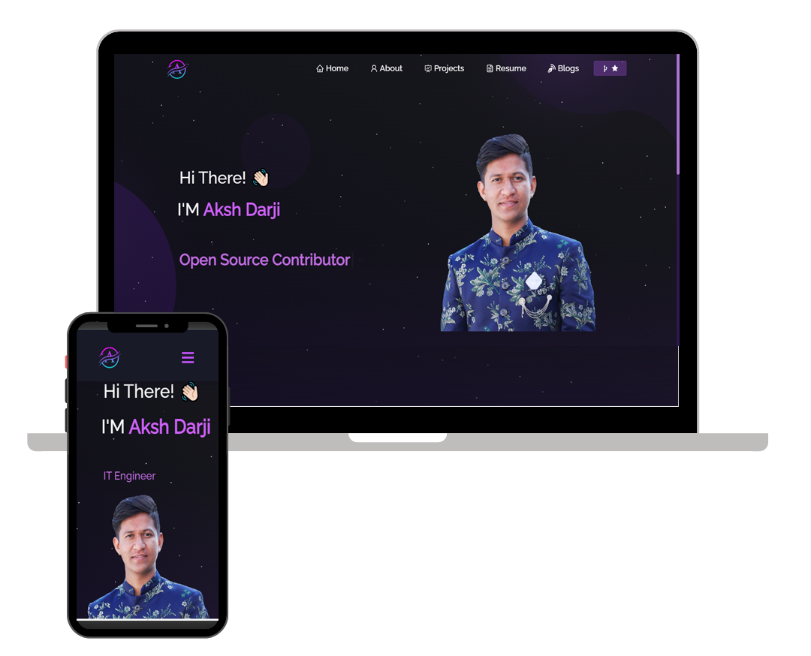

<h2 align="center">
  Portfolio Website - v2.0 
  <a href="https://aksh2002.github.io/Aksh-Portfolio/" target="_blank">Aksh Darji</a>
</h2>

  

## 🔗 Links

 

 &nbsp;
 &nbsp;
 &nbsp;

<h3 align="center">
    🔹
    <a href="https://github.com/aksh2002/Aksh-Portfolio/issues">Report Bug</a> &nbsp; &nbsp;
    🔹
    <a href="https://github.com/aksh2002/Aksh-Portfolio/issues">Request Feature</a>
</h3>

## Built With

My personal portfolio <a href="https://aksh2002.github.io/Aksh-Portfolio/" target="_blank">Aksh | Portfolio</a> which features some of my github projects as well as my resume and technical skills. 

This project was built using these technologies.

- React.js
- CSS3
- VsCode

## Features

**📖 Multi-Page Layout**

**🎨 Styled with React-Bootstrap and Css with easy to customize colors**

**📱 Fully Responsive**

## Getting Started

Clone down this repository. You will need `node.js` and `git` installed globally on your machine.

## 🛠 Installation and Setup Instructions

1. Installation: `npm install`

2. In the project directory, you can run: `npm start`

Runs the app in the development mode.\
Open [http://localhost:3000](http://localhost:3000) to view it in the browser.
The page will reload if you make edits.

## Usage Instructions

Open the project folder and Navigate to `/src/components/`.  
You will find all the components used and you can edit your information accordingly.

### Show your support

Give a ⭐ if you like this website!
 

If you have any feedback, please DM me at
 
 

